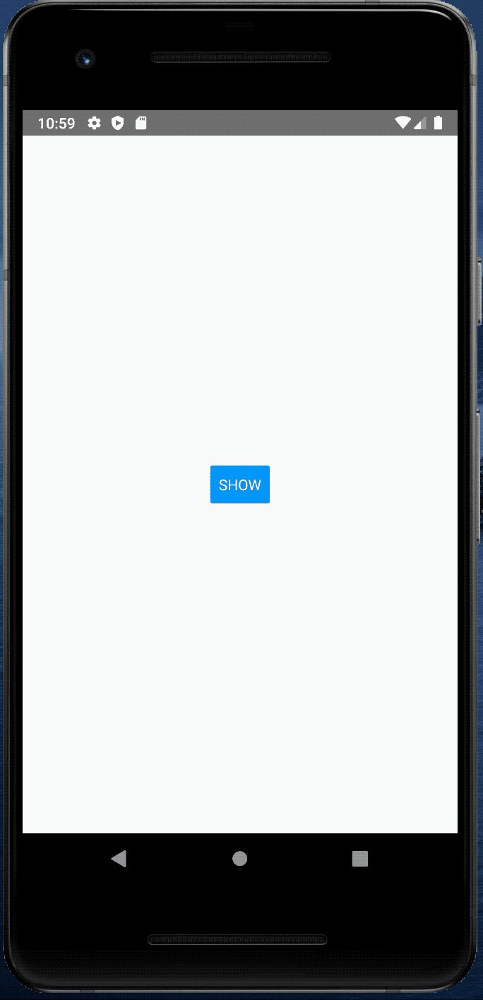
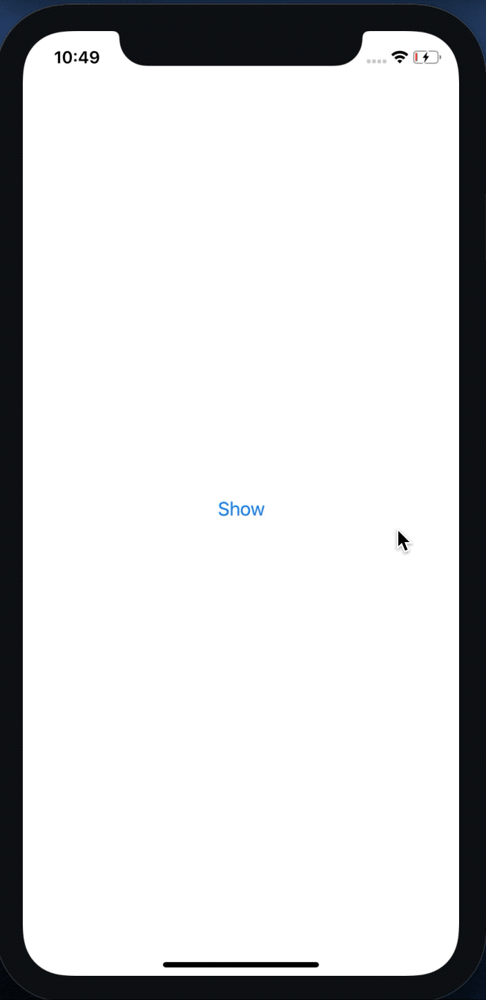

# rn-animated-snackbar

A snackbar component for Android and iOS

|                              Android                               |                              IOS                               |
| :----------------------------------------------------------------: | :------------------------------------------------------------: |
|  |  |

## Installation

1. Install:

- Using [npm](https://www.npmjs.com/#getting-started): `npm install rn-animated-snackbar --save`
- Using [Yarn](https://yarnpkg.com/): `yarn add rn-animated-snackbar`

2. Import it in your JS:

   ```js
   import Snackbar from 'react-native-snackbar';
   ```

## Usage

```tsx
import React from 'react';
import {Button, View, StyleSheet, SafeAreaView} from 'react-native';
import Snackbar from 'rn-animated-snackbar';

const App = () => {
  const [visible, setVisible] = React.useState(false);
  const onToggleSnackBar = () => setVisible(!visible);
  const onDismissSnackBar = () => setVisible(false);
  return (
    <SafeAreaView style={styles.safeAreaContainer}>
      <View style={styles.container}>
        <Button
          title={visible ? 'Hide' : 'Show'}
          onPress={onToggleSnackBar}
          style={styles.buttonStyle}
        />
        <View style={styles.snackbarContainer}>
          <Snackbar
            visible={visible}
            onDismiss={onDismissSnackBar}
            text={'Hello World'}
            action={{
              label: 'Hide',
              onPress: () => {
                setVisible(true);
              },
            }}
            duration={Snackbar.LENGTH_INFINITY}
          />
        </View>
      </View>
    </SafeAreaView>
  );
};

const styles = StyleSheet.create({
  safeAreaContainer: {
    flex: 1,
  },
  container: {
    flex: 1,
    justifyContent: 'center',
    alignItems: 'center',
  },
  snackbarContainer: {
    position: 'absolute',
    left: 0,
    bottom: 0,
    right: 0,
  },
});

export default App;
```

## Options

| Key              | Data type                  | Default value?          | Description                                                                                           |
| ---------------- | -------------------------- | ----------------------- | ----------------------------------------------------------------------------------------------------- |
| `visible`        | `boolean`                  | Required.               | Show or hide snackbar                                                                                 |
| `text`           | `style`                    | Required.               | The message to show.                                                                                  |
| `textStyle`      | `style`                    | `undefined`             | Text message style                                                                                    |
| `duration`       | number                     | `Snackbar.LENGTH_SHORT` | How long to display the Snackbar.                                                                     |
| `action`         | `object` (described below) | `undefined` (no button) | Optional config for the action button (described below).                                              |
| `onDismiss`      | `function`                 | Required                | Callback called when Snackbar is dismissed. The visible prop needs to be updated when this is called. |
| `containerStyle` | `style`                    | `undefined`             | Snackbar container style                                                                              |

Where `duration` can be one of the following (timing may vary based on device):

- `Snackbar.LENGTH_SHORT` (3s)
- `Snackbar.LENGTH_MEDIUM` (5s)
- `Snackbar.LENGTH_LONG` (10s)
- `Snackbar.LENGTH_INFINITY` (INFINITE)

The optional `action` object can contain the following options:

| Key                  | Data type  | Default value?                             | Description                                   |
| -------------------- | ---------- | ------------------------------------------ | --------------------------------------------- |
| `label`              | `string`   | Required.                                  | Label of the action button.                   |
| `accessibilityLabel` | `string`   | `undefined`                                | The color of the button text.                 |
| `labelStyle`         | `style`    | `undefined`                                | Label text style.                             |
| `onPress`            | `function` | `undefined` (Snackbar is simply dismissed) | A callback for when the user taps the button. |
